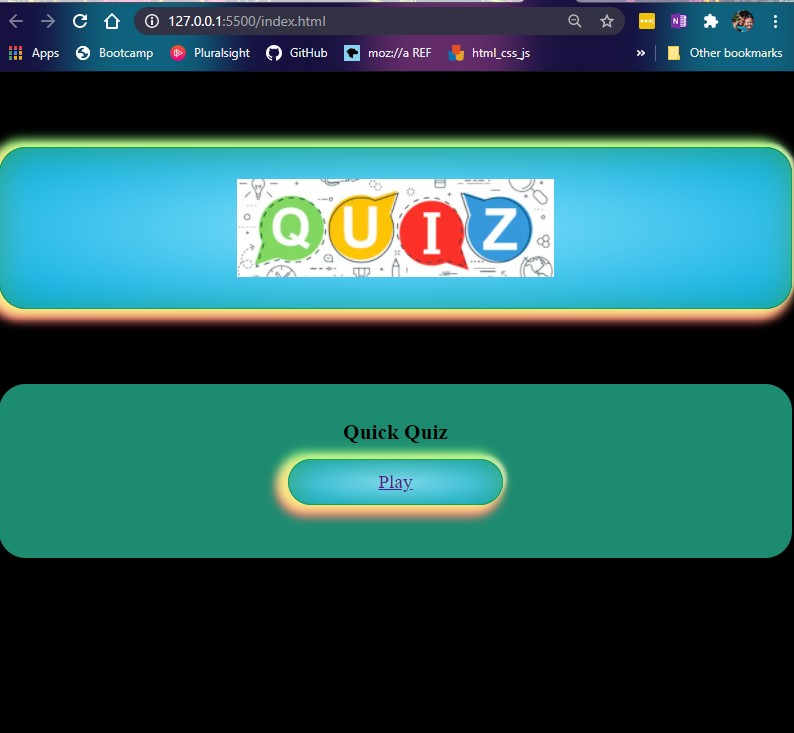
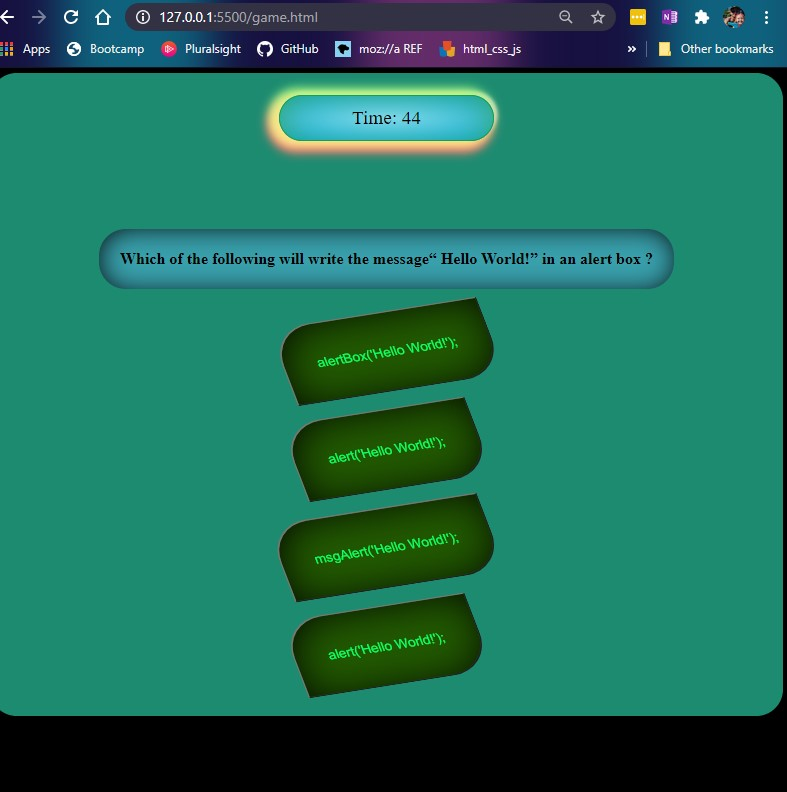

# TooSchool4CoolQuiz
I wanted to create a quiz that focused one dynamically updating the DOM so it could act as templet if you will. Only a few things in the JS folder would have to be changed and it is still a deployable test to say your high-school students or what have you.

1. There will be a landing page (HOME)

2. It would be timed.

3. A wrong answer would negate time.

4. At the end your score would be saved, and you could add your Initials.

## Table of contents
* [General info](#general-info)
* [Screenshots](#screenshots)
* [Setup](#setup)
* [Status](#status)
* [Inspiration](#inspiration)
* [Contact](#contact)

## General info

I struggled with the project more then any, and the whole process was a hug painful learning curve. I learned that I get ahead of myself very easily, because I understand how JavaScript works and I can very easily put tighter something AAWSMOME in my head that will or would work if only I had the missing dots already in my head. So in theory and during brainstorming I’m a genius, then when its time to turn my grandiose but practical application on paper I struggle more then anything. Its like being stuck in a country that does not understand your world but gets all of your body and facial expressions.

I am deploying this because i have givin it all the love i can afford right now. Im on to bigger and better things, maybe with a more humble misdset this time around.

## Screenshots

## Setup
Just go to the deployed page:
[Code Quiz link](https://mrfivefourone.github.io/tooSchool4CoolQuiz/)
s it is only html, css, and JavaScript

To-do list:
* Wow improvement to be done 1
* Wow improvement to be done 2

## Status
Project is: _in progress_, I have to leave this one for now and get a win under my belt. Im stuck on some things here and the worst thing I could do is dwell on it. Im going to move on and once i am refreshed I WILL be back to make this what it should be. What im truly capable of.

## Inspiration
Dane Shrewsberry : a professional confidant who has helped me through many coding problems.

[@flynerdpl](https://www.flynerd.pl/) : for this awsome readme.md outline.