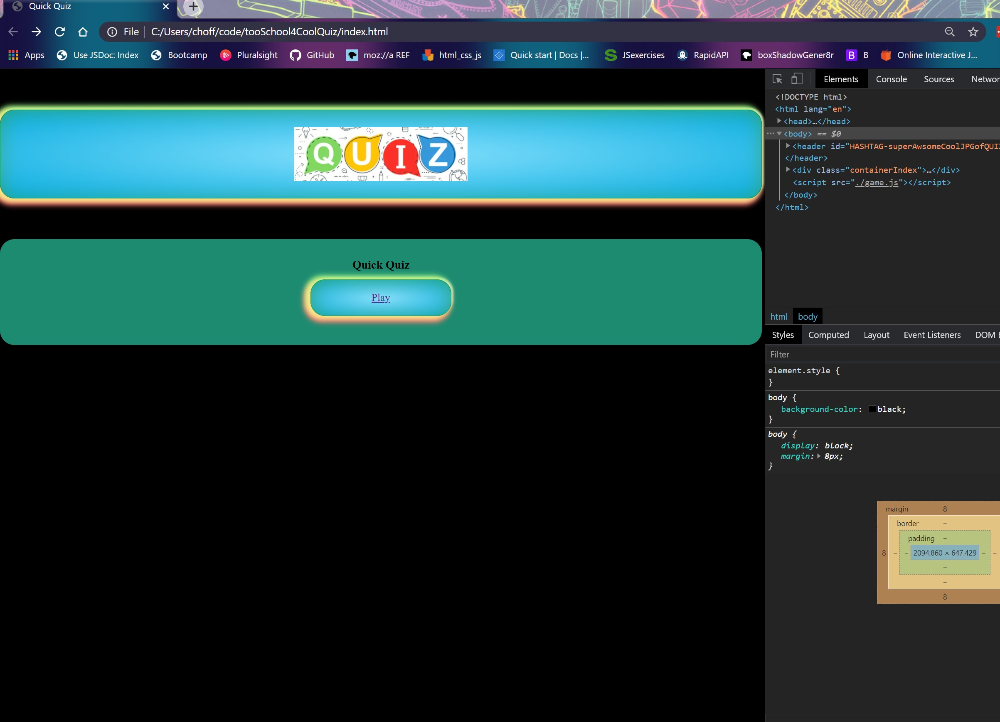
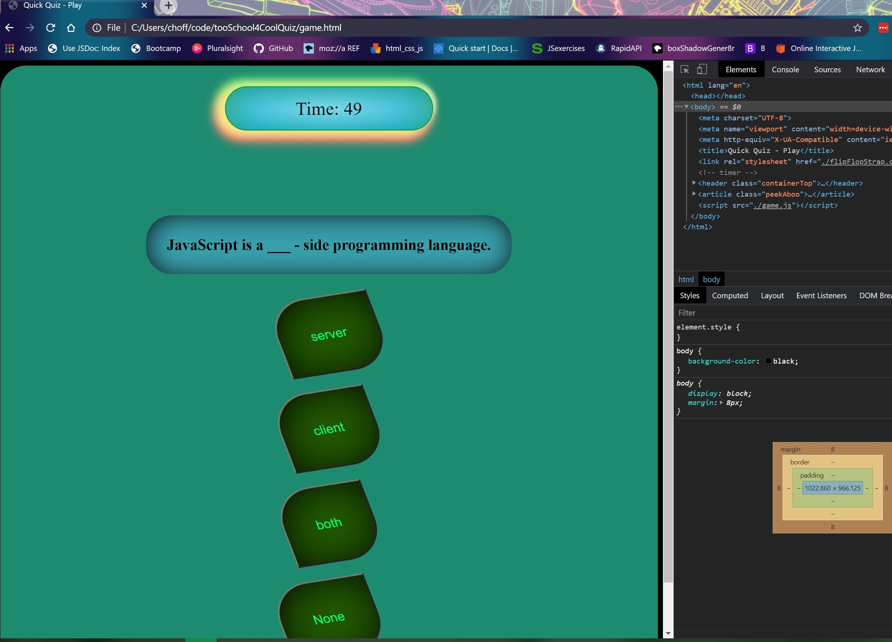
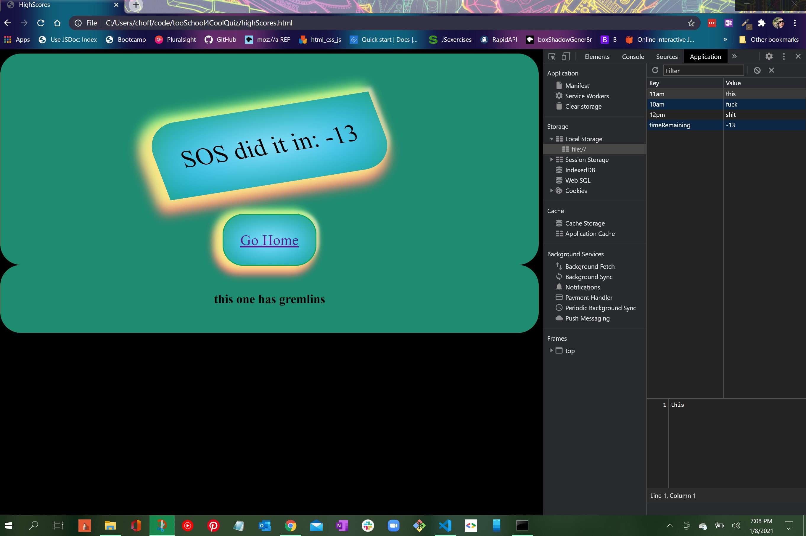

# TooSchool4CoolQuiz
I wanted to create a quiz that focused one dynamically updating the DOM so it could act as templet if you will. Only a few things in the JS folder would have to be changed and it is still a deployable test to say your high-school students or what have you.

1. There will be a landing page (HOME)

2. It would be timed.

3. A wrong answer would negate time.

4. At the end your score would be saved, and you could add your Initials.

## Table of contents
* [General info](#general-info)
* [Screenshots](#screenshots)
* [Setup](#setup)
* [Status](#status)
* [Inspiration](#inspiration)
* [Contact](#contact)

## General info (roadmap)

I have gotten this Quiz to an accepteble point to leave it for a while and come back to it later when I am grasping this stuff better. ( 1/8/21 )

I struggled with the project more then any, and the whole process was a hug painful learning curve. I learned that I get ahead of myself very easily, because I understand how JavaScript works and I can very easily put tighter something AAWSMOME in my head that will or would work if only I had the missing dots already in my head. So in theory and during brainstorming I’m a genius, then when its time to turn my grandiose but practical application on paper I struggle more then anything. Its like being stuck in a country that does not understand your world but gets all of your body and facial expressions.

I am deploying this because i have givin it all the love i can afford right now. Im on to bigger and better things, maybe with a more humble misdset this time around. ( 12/22/21 )

## Screenshots

Like the HighScore Page says this one has Gremlins. It does however work now!!!!

## Setup

Just go to the deployed page:

[Code Quiz link](https://mrfivefourone.github.io/tooSchool4CoolQuiz/)

(Aperently not too COOL for SCHOOL after all....!)

To-do list:

* Make the highScores print to a list.

* For time sake I am leaving this as is, I have learned some valuable leasons with this one, When i have time I will come back and do this justice. Mkae it look like something a professional would want to use in a class situation.

## Status (roadmap)

Project is: _in progress_,( 12/22/20 )I have to leave this one for now and get a win under my belt. Im stuck on some things here and the worst thing I could do is dwell on it. Im going to move on and once i am refreshed I WILL be back to make this what it should be. What im truly capable of.

Project is: _WORKING_, ( 1/8/21 )I have had some time to adjust some things and make it work at the verry minumum. I wouldnt call this finished quit yet.

Project is; _Finished_, (later in day 1/8/21)I got everyhting to work, right now my only qualm is that is doest list the highscores in a nice neat list but as one continues sentence.

## Inspiration

Dane Shrewsberry : a professional confidant who has helped me through many coding problems.

Janani N. : another peer in the industry that helped me learn from my mistakes.

[@flynerdpl](https://www.flynerd.pl/) : for this awsome readme.md outline.